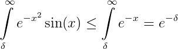

# Численное интегрирование
# 9.13(Б) 
Т.к. справедлива цепочка неравенств:

Format: 
То будем вычислять интеграл до того момента, когда exp(-delta) не станет очень маленькой (меньше всего посчиатнного интеграла с требуемой точностью)
После этого можно и остановится. 
